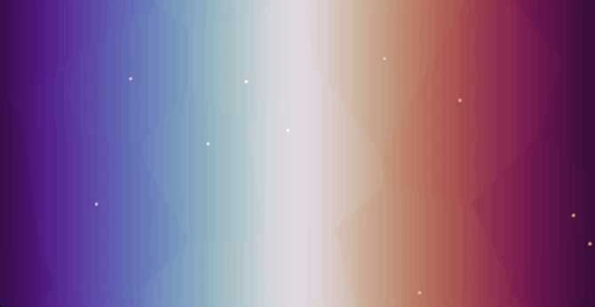
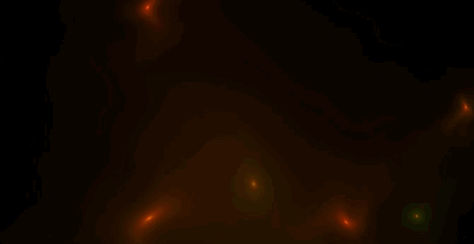
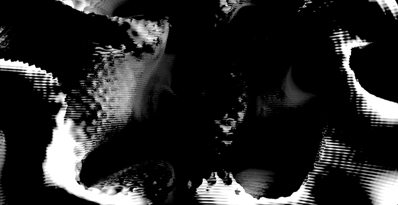
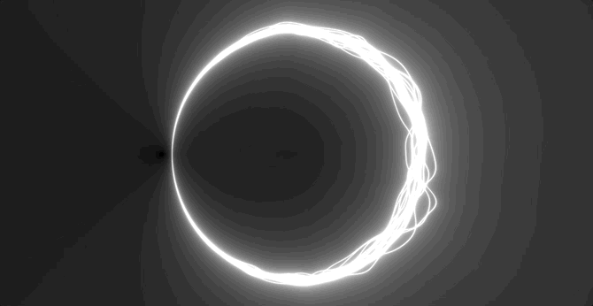
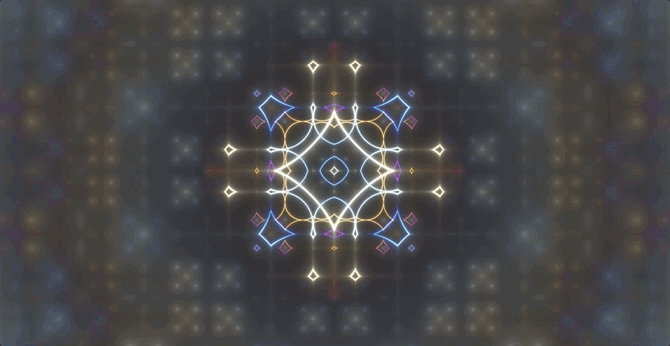
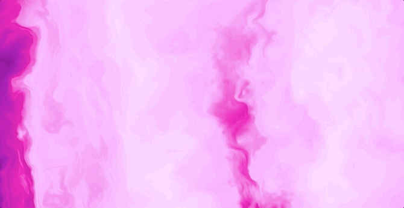
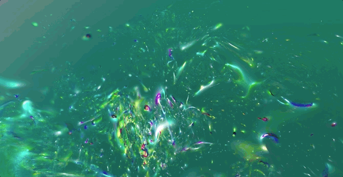
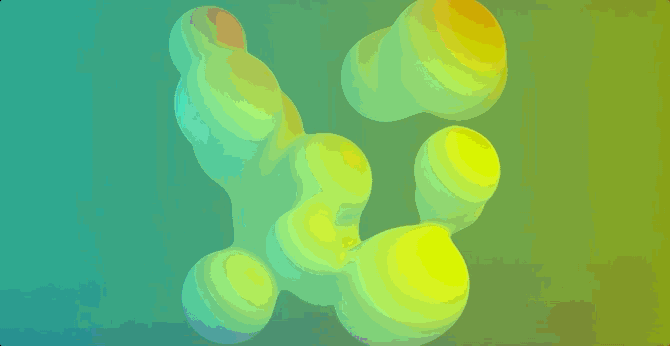
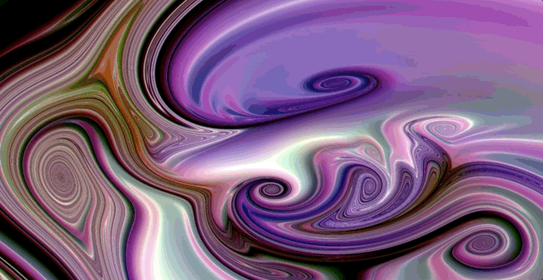

# Unity-ShaderScripts
A collection of Unity URP shader examples that explore generative, procedural, and dynamic effects.  
These shaders highlight a variety of techniques—from Voronoi-based distortions to raymarching fractals—crafted for real-time visual experiments.

---

## 🎨 Shaders

### Voronoi Effect

A real-time Voronoi effect shader that animates Voronoi cells and displaces an underlying texture.  
- **Controls**: _VoronoiScale_, _TimeSpeed_, _DisplacementAmount_.  
- **Effect**: Animated cell boundaries, subtle texture warping, and glowing Voronoi edges.

---

### Moving Lights

A dynamic shader with moving light waves and color cycling.  
- **Controls**: _Scale_, _Offset_, _Rotation_, _Speed_, _Iterations_, _Colors_, _Distortion_, _WaveIntensity_, _Detail_.  
- **Effect**: Vivid, kaleidoscopic light animations with rotating patterns.

---

### Ionize

A raymarching shader rendering 3D gyroid structures with glow and turbulence.  
- **Controls**: _Speed_, _Turbulence_, _Iterations_, _StepSize_, _MaxDistance_, _Size_, _Thickness_, _BoundarySize_, _Zoom_, _CameraDistance_, _Colors_, _GlowIntensity_.  
- **Effect**: Dynamic gyroid structures glowing and morphing over time.

---

### Gyro Fractal Field

A fractal field shader using sine waves and dot products to build animated 3D structures.  
- **Controls**: _SineAmp_, _Freq1_, _Freq2_, _Scale_, _MaxSteps_, _StopThreshold_, _MaxDistance_, _ColorIntensity_.  
- **Effect**: Dynamic grayscale fractal field with shifting forms.

---

### Noise Rings

A shader that generates animated noise-driven rings.  
- **Controls**: _RingCount_, _RingRadius_, _NoiseStrength_, _GlowIntensity_, _TimeScale_, _Offset_.  
- **Effect**: Radiating rings with a glowing effect and organic noise motion.

---

### Kaleidoscopic Lines

A dynamic shader featuring rotating UVs and palette-based color mixing.  
- **Controls**: _PaletteA_, _PaletteB_, _PaletteC_, _PaletteD_, _TimeScale_, _UVScale_, _Iterations_, _SinScale_, _PowExponent_.  
- **Effect**: Vivid kaleidoscopic visuals with evolving colors.

---

### Base Warp

A fractal-brownian-motion-based shader blending noise and rotation.  
- **Controls**: _FBM_ weights, _TimeSpeed_, _Brightness_, _Rotation_.  
- **Effect**: Layered FBM textures with subtle color mapping and rotation.

---

### Fractals

A raymarching fractal shader with dynamic rotation and distance-based shading.  
- **Controls**: _MaxIterations_, _InnerIterations_, _RotationSpeed_, _RotationIntensity_, _Brightness_, _DistanceScale_, _ColorIntensity_.  
- **Effect**: Evolving 3D fractal visuals that respond to rotation and distance.

---

### Raymarching

A parametric raymarching shader for animated spheres with smooth union blending.  
- **Controls**: _NumIterations_, _SmoothUnionK_, _NumSpheres_, _SphereSizeMin_, _SphereSizeMax_, _SceneScale_, _DepthFade_, _Brightness_, _AnimationSpeed_.  
- **Effect**: Flowing sphere fields that shift and blend smoothly.

---

### Dynamic Flow

A dynamic 2D shader that combines random offset patterns with color adjustments.  
- **Controls**: _TimeScale_, _TimeOffset_, _ZScale_, _ColMultiplier_, _ExpMultiplier_, _ColorAdjust1-3_, _PowExponent_, _UVMul_, _UVExponent_, and more.  
- **Effect**: Flowing shapes and color textures driven by evolving shapes.

---

## 📝 License
All shaders in this repository are released under the **Creative Commons CC0 1.0 Universal (CC0 1.0)** license.

**You are free to:**
- Share — copy and redistribute the material in any medium or format.
- Adapt — remix, transform, and build upon the material for any purpose, even commercially.

**No conditions.** You do not need to give credit or seek permission.

For more information, see: [CC0 1.0 Universal](https://creativecommons.org/publicdomain/zero/1.0/)

---

## 📦 Contributing
These shaders are intended for learning, experimentation, and inspiration.  
Feel free to fork the repository, adapt the shaders, and share your own variations!